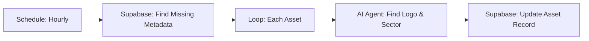

# Upgrade: Automated Asset Intelligence Pipeline

## Overview
This upgrade adds a "Set and Forget" AI pipeline that automatically enhances your asset portfolio. When you add an asset (e.g., "AAPL" or "BTC") to your portfolio, this background workflow detects it, uses an AI Agent to research the asset, and updates the record with:
1.  **High-Quality Logo**: Visual icon for the asset.
2.  **Sector**: Industrial classification (e.g., "Technology", "DeFi").
3.  **Market Cap**: Approximate market valuation.

## Architecture

## Setup Instructions

### 1. Import Workflow
1.  Open your n8n dashboard (http://localhost:5678).
2.  Click **"Add Workflow"** > **"Import from..."** > **"Local File"**.
3.  Select: `C:\Users\malco\HAL9000ai\TitanTerminalOS3.0\execution\asset_enrichment_workflow.json`

### 2. Configure Credentials
1.  **Supabase Node**: Select your existing "Supabase Connection".
2.  **AI Intelligence Agent**: 
    *   Click on the node.
    *   Under "Credential to connect with", select your **OpenAI account** (same one used for News).
    *   Ensure Model is `gpt-4o-mini`.

### 3. Activate
1.  Click **Execute Workflow** to test it immediately (it will process any existing assets that lack images).
2.  Toggle **"Active"** to ON (top right).

### 4. Verify
1.  Go to your Titan Terminal dashboard > **Assets**.
2.  You should now see logos next to your asset symbols and sector tags (e.g., "Technology") under the name.
