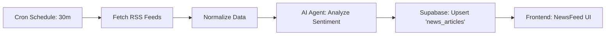

# Strategic Market Intelligence Upgrade Guide

## Overview
This upgrade implements an AI-driven News Aggregator and Sentiment Analyzer. It automatically fetches financial news from RSS feeds, uses an AI Agent (via n8n) to analyze the sentiment (0-100), and pushes the analyzed data to Titan Terminal in real-time.

## 1. System Architecture

## 2. Implementation Steps

### Step 1: Database Setup (Supabase)
*Status: Completed*
The `news_articles` table has been created with the following schema:
- `id`: bigint (primary key)
- `title`: text
- `url`: text
- `source`: text
- `sentiment_score`: numeric (0-100)
- `summary`: text
- `created_at`: timestamptz

### Step 2: n8n Workflow Import
1. Open your n8n dashboard.
2. Click **"Add Workflow"** > **"Import from..."** > **"File"**.
3. Select the file: `execution/news_sentiment_workflow.json`
4. **Configuration**:
   - **Credentials**: You MUST set up your OpenAI credentials in n8n for the "AI Sentiment Analysis" node.
   - **Supabase**: Ensure your Supabase credential is selected in the "Supabase: Save News" node.
5. Click **Activate**.

### Step 3: Frontend Validation
*Status: Completed*
The application is updated to listen for real-time changes in the `news_articles` table.
- `types.ts`: Updated with `NewsArticle` interface.
- `services/newsService.ts`: Added news fetching logic.
- `components/NewsFeed.tsx`: Refactored to display sentiment scores and live updates from the database.

## 3. External Dependencies
- **OpenAI API Key**: Required for the n8n AI node.
- **Supabase**: Realtime features enabled (default).
- **RSS Feeds**: Uses Coindesk and Yahoo Finance by default; can be customized in n8n.

## 4. Testing
1. In n8n, click **"Execute Workflow"**.
2. Wait for the green checkmarks.
3. Check the "Global Newswire" widget in Titan Terminal. You should see new articles appear with color-coded sentiment badges (Green=Bullish, Red=Bearish).
