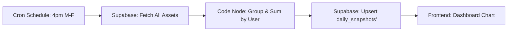

# Daily Portfolio Snapshot Upgrade Guide

## Overview
This upgrade implements an automated background process using **n8n v2.6.3** to capture the net worth of every user at market close (4:00 PM EST). This data powers the historical performance charts on the Dashboard.

## 1. System Architecture

## 2. Implementation Steps

### Step 1: Database Setup (Supabase)
*Status: Completed*
The `daily_snapshots` table has been created with the following schema:
- `id`: bigint (primary key)
- `user_id`: uuid (foreign key to auth.users)
- `total_value`: numeric
- `currency`: text (default 'USD')
- `snapshot_date`: timestamptz

### Step 2: n8n Workflow Import
1. Open your n8n dashboard (localhost:5678).
2. Click **"Add Workflow"** > **"Import from..."** > **"File"**.
3. Select the file: `execution/daily_snapshot_workflow.json`
4. **Configuration**:
   - Double click the **Supabase** nodes.
   - Ensure your `Supabase Connection` credential is selected.
   - Verify the `Table ID` is set to `assets` (Node 2) and `daily_snapshots` (Node 4).
5. Click **Activate** (toggle top right) to enable the schedule.

### Step 3: Verify Frontend
*Status: Completed*
The application code has already been updated:
- `types.ts`: Added `PortfolioSnapshot` interface.
- `storageService.ts`: Added `getPortfolioHistory()` function.
- `Dashboard.tsx`: Integrated the historical chart to use live data.

## 3. External Dependencies
- **Supabase**: Requires a valid project with `assets` and `daily_snapshots` tables.
- **n8n**: Requires version 2.x+ running with access to the Supabase API.

## 4. Testing
To test immediately without waiting for market close:
1. Open the workflow in n8n.
2. Click **"Execute Workflow"** at the bottom.
3. Check the `daily_snapshots` table in Supabase to see if a new row was added for your user.
4. Refresh the Titan Terminal Dashboard; the "Today" dot on the chart should update.
